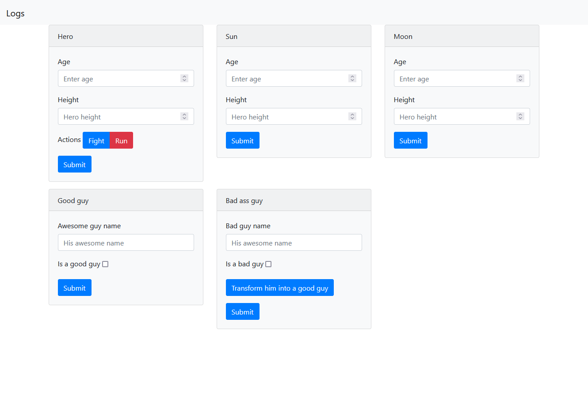
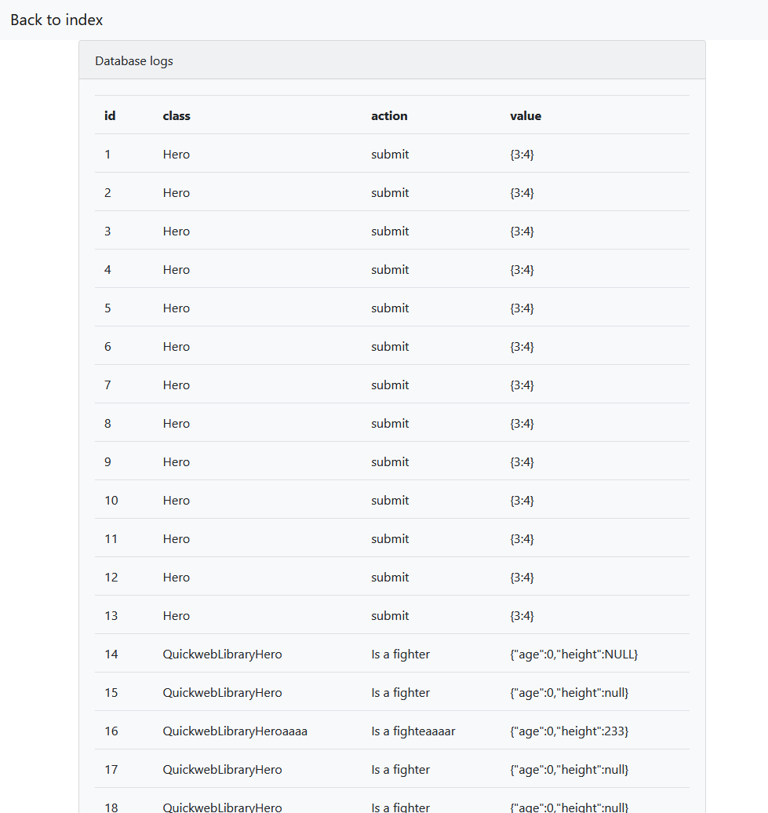

Xampp host:

```
<VirtualHost *:80>
    ServerName quickweb.local
    DocumentRoot D:\www\celestial
    <Directory D:\www\celestial>
        AllowOverride All
        Options +FollowSymLinks +IncludesNOEXEC +SymLinksIfOwnerMatch -MultiViews
        Require all granted
        <IfModule mod_rewrite.c>
            Options -MultiViews
            RewriteEngine On
            RewriteCond %{REQUEST_FILENAME} !-f
            RewriteRule ^(.*)$ index.php [QSA,L]
        </IfModule>
    </Directory>
    ErrorLog D:\logs\quickweb.local-error.log
    CustomLog D:\logs\quickweb.local-access.log combined
</VirtualHost>
```

Hosts:
```
    127.0.0.1 quickweb.local www.quickweb.local
```


Create a database, define connection settings in `src/database/database.php`
```
CREATE DATABASE `epic_story`;
CREATE TABLE `logs` (
`id` int(11) unsigned NOT NULL AUTO_INCREMENT,
`class` varchar(255) NOT NULL,
`action` varchar(255) NOT NULL,
`value` text NOT NULL,
PRIMARY KEY (`id`)
) ENGINE=InnoDB DEFAULT CHARSET=latin1;
```

Setup:
```
composer install
```
Then create the database, add database credentials in ``Connection.php``

Images:

Logs:


